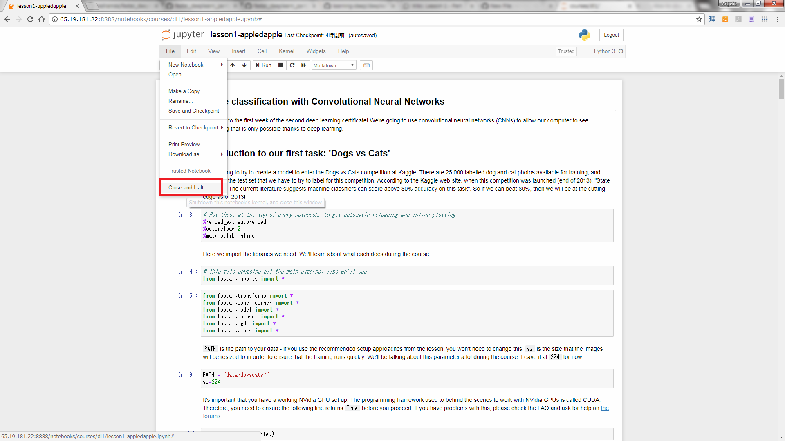
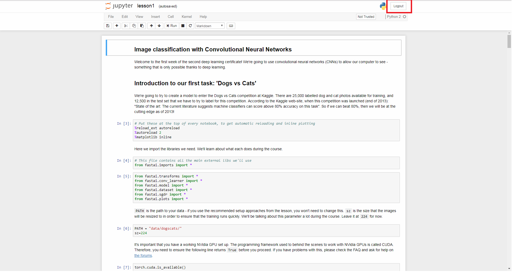

### Workflow
1. Start paperspace fastai machine
2. Login using the password emailed by paperspace
	* paste in terminal using <kbd>Ctrl + Shift + V</kbd> (Windows)
3. Update fastai repository contents
	<kbd>git pull</kbd>
	* go to fastai directory
	```bash
    (fastai) paperspace@psaldrwiq:~$ cd fastai
    (fastai) paperspace@psaldrwiq:~/fastai$ git pull
	 Already up-to-date.
    ```
	* update the repository everytime you login
4. Update Python/Anaconda Libraries
	<kbd>conda env update</kbd>
	* make sure to be at the fastai directory
	* update the libraries at least once a week
5. Launch Jupyter Notebook
	* Go to fastai directory
	* Enter <kbd>jupyter notebook</kbd>
	```bash
    (fastai) paperspace@psaldrwiq:~/fastai$ jupyter notebook
	[I 01:42:42.798 NotebookApp] Writing notebook server cookie secret to /run/user/1000/jupyter/notebook_cookie_secret
	[W 01:42:43.264 NotebookApp] WARNING: The notebook server is listening on all IP addresses and not using encryption. This is not recommended.
	[I 01:42:43.303 NotebookApp] [jupyter_nbextensions_configurator] enabled 0.4.0
	[I 01:42:43.306 NotebookApp] Serving notebooks from local directory: /home/paperspace/fastai
	[I 01:42:43.306 NotebookApp] 0 active kernels
	[I 01:42:43.306 NotebookApp] The Jupyter Notebook is running at:
	[I 01:42:43.306 NotebookApp] http://psaldrwiq:8888/?token=be76432568e304b3a23f0a1bf64c86054d4eb0b7426c18c7
	[I 01:42:43.306 NotebookApp] Use Control-C to stop this server and shut down all kernels (twice to skip confirmation).
	[C 01:42:43.307 NotebookApp] 
    
    Copy/paste this URL into your browser when you connect for the first time,
    to login with a token:
        http://psaldrwiq:8888/?token=be76432568e304b3a23f0a1bf64c86054d4eb0b7426c18c7&token=be76432568e304b3a23f0a1bf64c86054d4eb0b7426c18c7
    ```
6. Copy <kbd>Ctrl + Shift + C</kbd> the notebook url. Replace "psaldrwiq" with the machine's ip address & paste into local browser.
7. Open a notebook and make a copy with a different name.
8. Do the lesson.
9. Close and Halt the running notebook.
</img>

10. Logout from Jupyter.
</img>

11. Shutdown the machine.


